# AWS PROJECT : AWS CLOUDTRAIL THREAT DETECTION & IAM ABUSE MONITORING

## CONTROL-PLANE SECURITY MONITORING USING NATIVE AWS SERVICES

## INTRODUCTION
In this project, I designed and implemented control-plane threat detection in AWS by monitoring IAM and account-level activities using AWS CloudTrail, Amazon CloudWatch Logs, CloudWatch Metric Filters, CloudWatch Alarms, and Amazon SNS.
Rather than focusing on network traffic, I intentionally focused on the AWS control plane — the layer where API calls, authentication events, and identity actions occur. This allowed me to answer critical security questions such as:
-	Who performed an action in the AWS account?
-	What action was performed?
-	When and from where did it occur?
This project reflects how real-world Cloud SOC and Cloud Security Engineering teams detect credential abuse, privilege escalation, and account compromise using native AWS services

## PROJECT OBJECTIVES
-	Enable centralized CloudTrail logging across the AWS account
-	Capture IAM and authentication-related API activity
-	Stream CloudTrail logs to CloudWatch Logs for near-real-time analysis
-	Detect high-risk IAM and account actions using metric filters
-	Trigger immediate security alerts using CloudWatch Alarms
-	Deliver alerts through a centralized SNS notification channel

## SERVICES USED
-	AWS CloudTrail
-	Amazon S3 (log archival)
-	Amazon CloudWatch Logs
-	CloudWatch Metric Filters
-	CloudWatch Alarms
-	Amazon SNS

# 
 STEPS INVOLVED

## STEP 1 - ENABLING AWS CLOUDTRAIL
-	I enabled AWS CloudTrail to capture management (control-plane) events across the entire AWS account.
-	I created a new CloudTrail trail
-	I enabled both Read and Write management events
-	I applied the trail to all AWS regions to avoid blind spots
-	I enabled log file integrity validation
-	An IAM role that allowed CloudTrail to send logs to CloudWatch was also created together with the trail
-	I configured CloudTrail to deliver logs to:
	Amazon S3 for long-term storage and auditing
	Amazon CloudWatch Logs for near-real-time detection

This ensured full visibility into IAM actions, authentication attempts, and sensitive account-level API calls.

## STEP 2 - CLOUDWATCH LOG GROUP VERIFICATION
-	After enabling log delivery, I verified that CloudTrail events were successfully reaching CloudWatch Logs.
-	The CloudWatch log group was created automatically
-	Log streams were actively receiving events
-	CloudTrail records were in valid JSON format
-	This confirmed that control-plane activity was being ingested correctly.

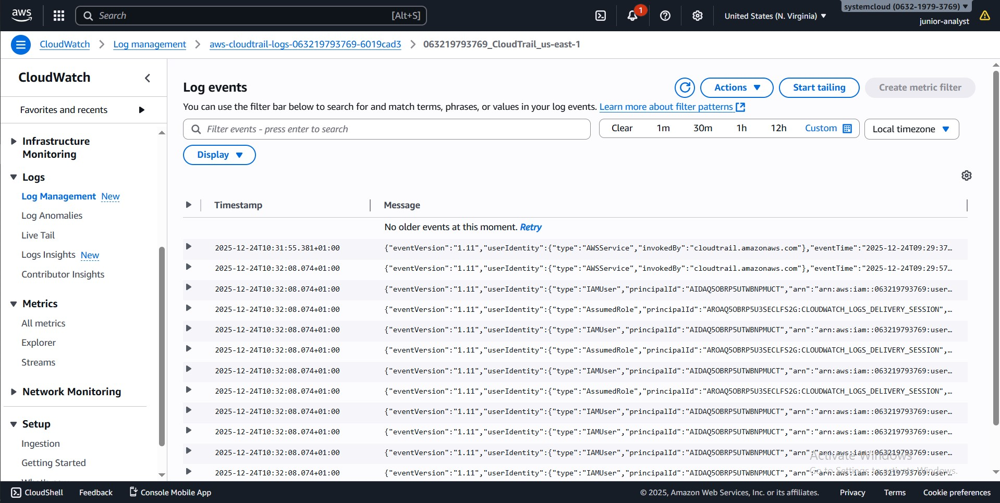

## STEP 3 - THREAT DETECTION USE CASES
I selected the following high-risk IAM and account activities based on common real-world attack techniques.
#### Root Account Usage
- Best practices advices against the use of Root account for daily activities.
- Root account usage is extremely rare and often indicates an emergency or compromise.
#### Console Login Without MFA
Console logins without MFA significantly increase the risk of account takeover.
#### IAM Policy Changes (Privilege Escalation)
Changes to IAM policies can indicate privilege escalation attempts and so it is advisable to keep that in check.
#### Access Key Creation
Access key creation enables long-term programmatic access and is a common attacker objective and so it is also advisable to keep it in check
#### CloudTrail Tampering Attempts
Attackers often attempt to disable logging to hide their actions.

## STEP 4 - CREATING CLOUDWATCH METRIC FILTERS BASED ON THE ABOVE ACCOUNT ACTIVITIES.
- For each detection use case, I created CloudWatch metric filters to transform raw CloudTrail log events into measurable security signals.
- First, I have to simulate these events so there will be an available log to test the filter patterns for the metric filter
- After this I went ahead to create metric filter, using the appropriate JSON for each detection and testing the filter pattern to make sure it is accurate.
- These were done under the log group for the CloudTrail logging
- The metric filter for the 5 activities was all created and ready for use.

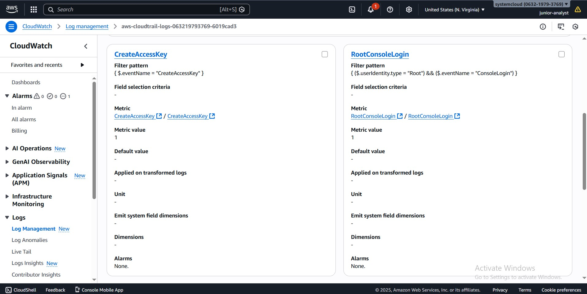

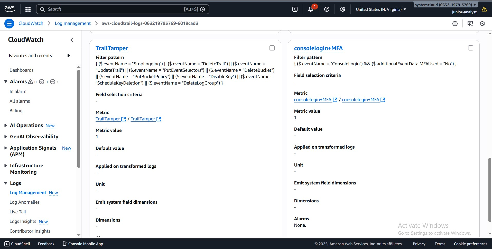

## STEP 5 - SNS ALERTING 
-	To centralize alert delivery, I created a single Amazon SNS topic.
-	I subscribed my email to the topic
-	A confirmation email was sent to me, which I confirmed.

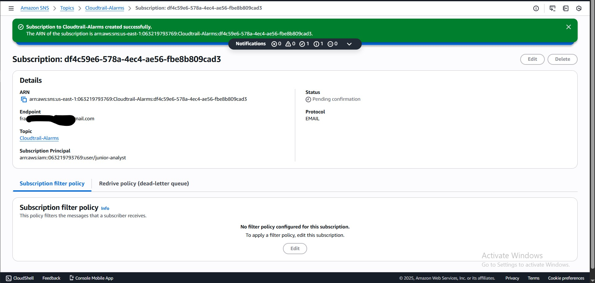

## STEP 6 – CREATING CLOUDWATCH ALARMS
-	I configured CloudWatch alarms for near-immediate detection of suspicious activity for each metric filter I created. 
-	Alarm Configuration Used

|Setting	|Value|
|:---------:|:----------:|
|Statistic	|Sum|
|Period	|1 minute|
|Threshold |	≥ 1|

-	This configuration was used for each metric filter
-	The SNS topic initially created was attached to each alarm, this allows for near immediate reception of email notification from the topic anytime an alarm was triggered

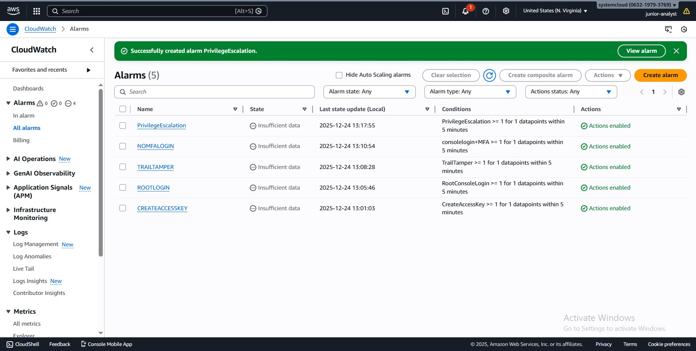

## STEP 7 - VALIDATION AND TESTING
To validate the setup, I performed controlled testing:
-	I executed test IAM actions manually
-	I confirmed the corresponding CloudTrail events appeared in CloudWatch Logs
-	I verified metric filters incremented correctly
-	I observed alarms transitioning to the ALARM state
-	I received email notifications via SNS

This confirmed that the detection and alerting pipeline was functioning end-to-end.

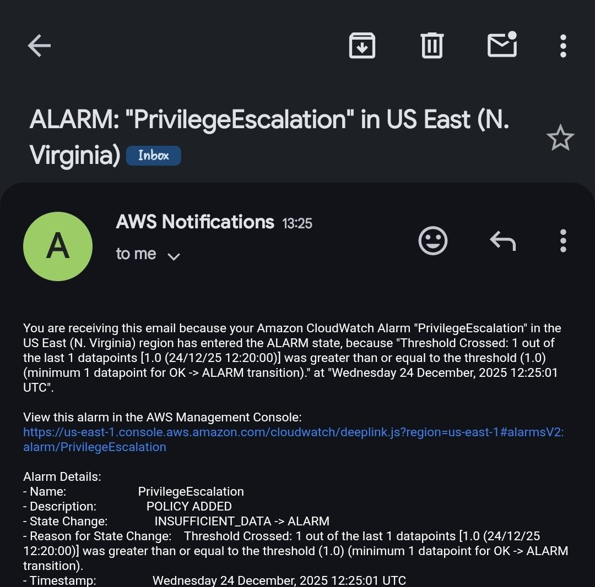

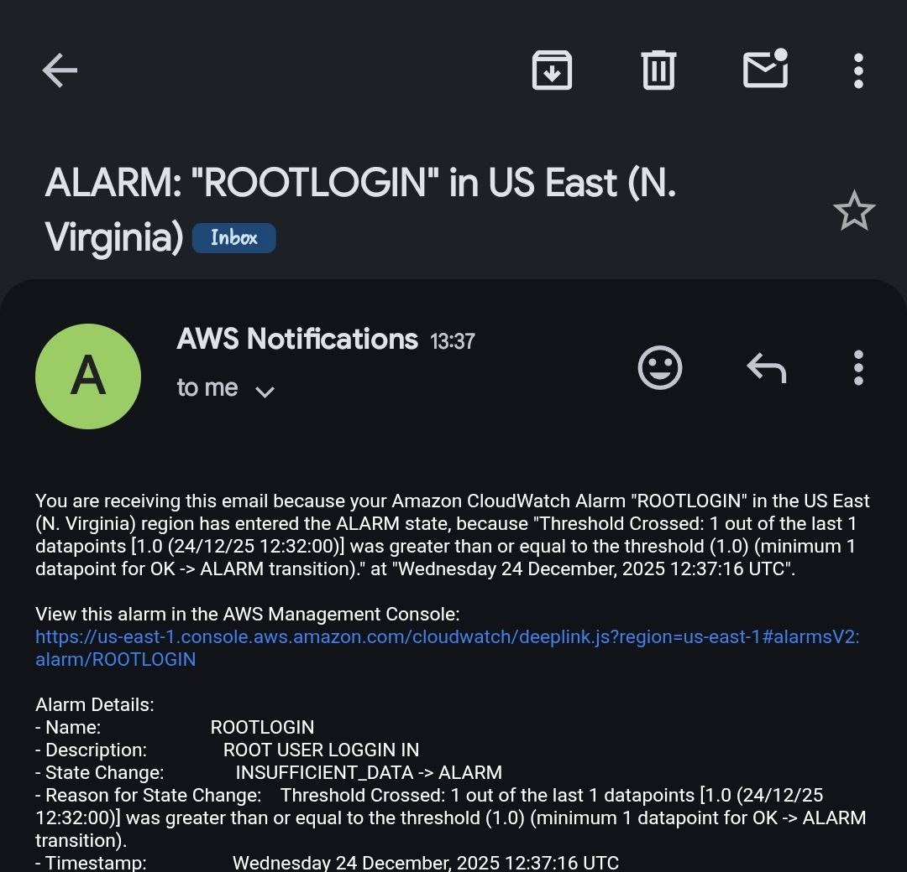

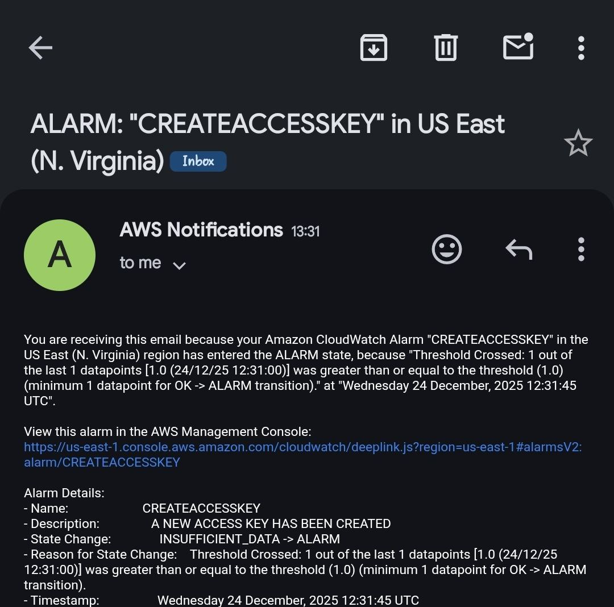

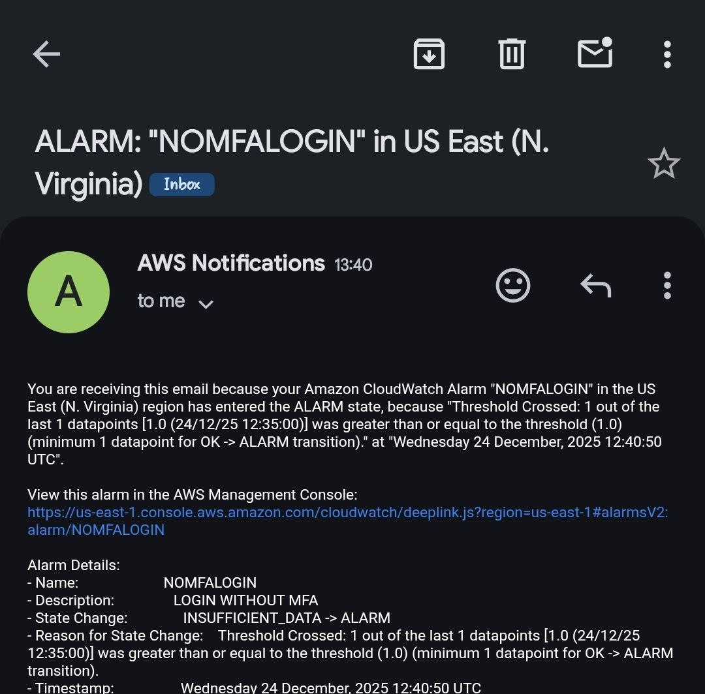

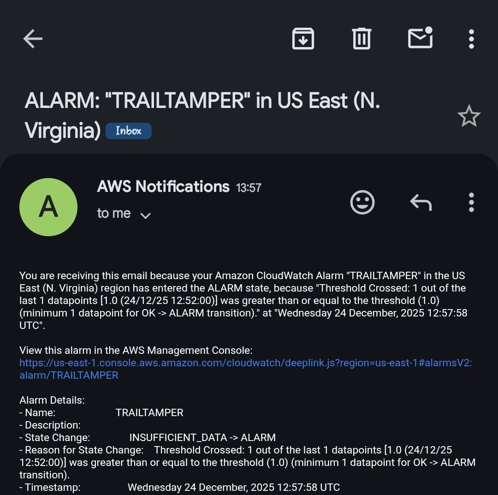

## SECURITY VALUE AND USE CASES
This implementation provides:
-	Early detection of compromised credentials
-	Visibility into unauthorized privilege escalation
-	Monitoring of audit-log tampering attempts
-	Faster incident response capability
-	Improved compliance and audit readiness

## CHALLENGES ENCOUNTERED
During this project, I encountered several challenges:
-	Writing accurate metric filter patterns
-	Accounting for CloudWatch evaluation delays

I resolved these challenges through, documentation review, Google and AI search and iterative testing.

## WHAT I LEARNT
Through this project, I gained hands-on experience with:
-	Control-plane security monitoring in AWS
-	IAM abuse detection techniques
-	CloudTrail log analysis
-	How to write CloudWatch metric filter patterns

# 
ROUGH WORK

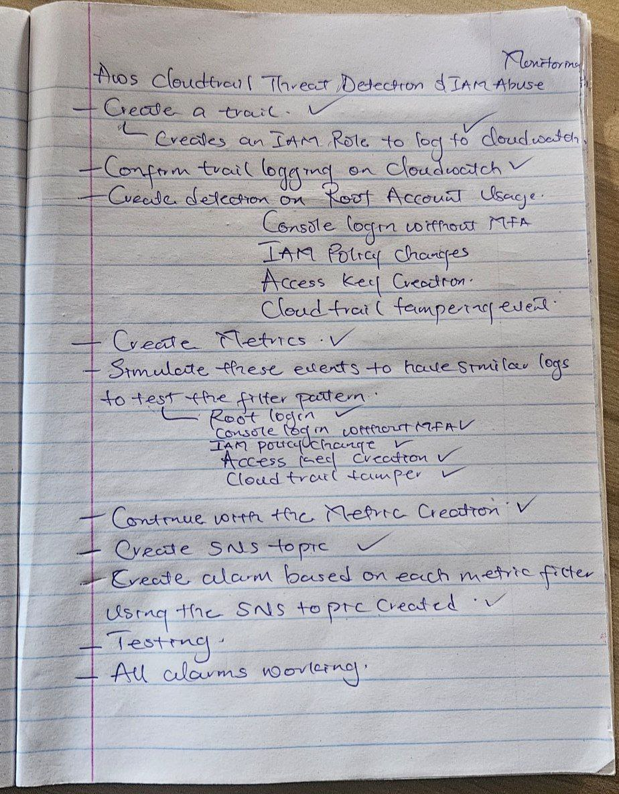

