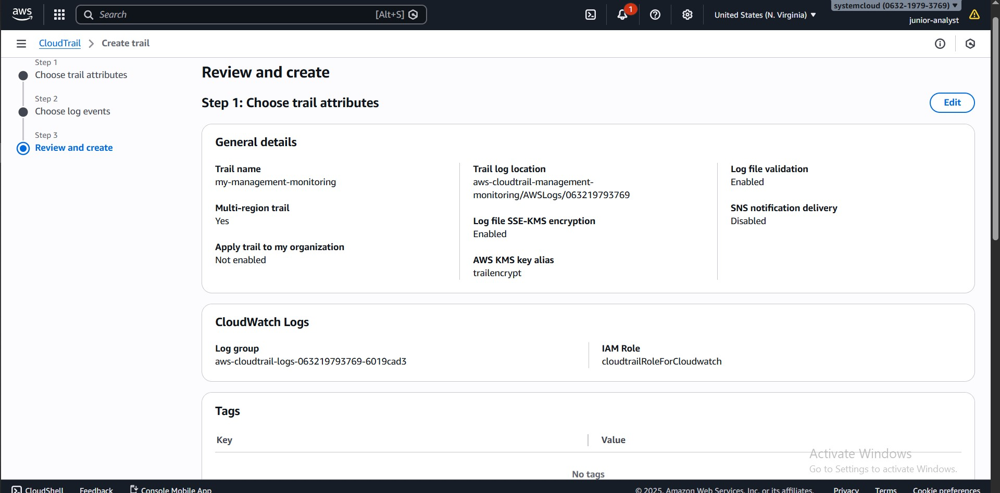
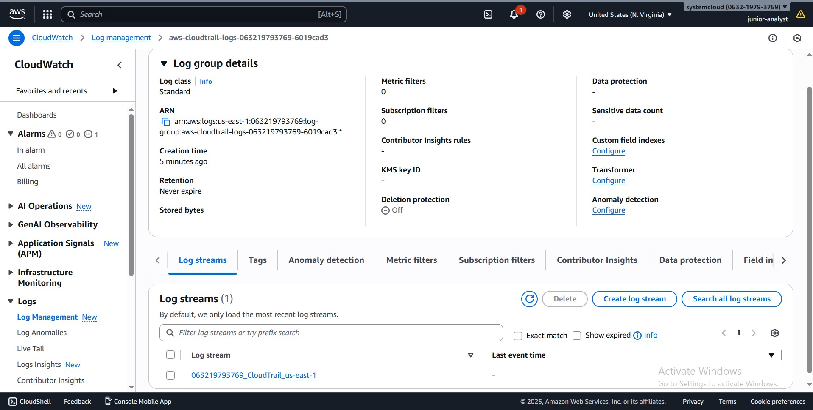

# AWS PROJECT : AWS CLOUDTRAIL THREAT DETECTION & IAM ABUSE MONITORING

## CONTROL-PLANE SECURITY MONITORING USING NATIVE AWS SERVICES

## INTRODUCTION
In this project, I designed and implemented control-plane threat detection in AWS by monitoring IAM and account-level activities using AWS CloudTrail, Amazon CloudWatch Logs, CloudWatch Metric Filters, CloudWatch Alarms, and Amazon SNS.
Rather than focusing on network traffic, I intentionally focused on the AWS control plane — the layer where API calls, authentication events, and identity actions occur. This allowed me to answer critical security questions such as:
-	Who performed an action in the AWS account?
-	What action was performed?
-	When and from where did it occur?
This project reflects how real-world Cloud SOC and Cloud Security Engineering teams detect credential abuse, privilege escalation, and account compromise using native AWS services

## PROJECT OBJECTIVES
-	Enable centralized CloudTrail logging across the AWS account
-	Capture IAM and authentication-related API activity
-	Stream CloudTrail logs to CloudWatch Logs for near-real-time analysis
-	Detect high-risk IAM and account actions using metric filters
-	Trigger immediate security alerts using CloudWatch Alarms
-	Deliver alerts through a centralized SNS notification channel

## SERVICES USED
-	AWS CloudTrail
-	Amazon S3 (log archival)
-	Amazon CloudWatch Logs
-	CloudWatch Metric Filters
-	CloudWatch Alarms
-	Amazon SNS

# 
 STEPS INVOLVED

## STEP 1 - ENABLING AWS CLOUDTRAIL
-	I enabled AWS CloudTrail to capture management (control-plane) events across the entire AWS account.
-	I created a new CloudTrail trail
-	I enabled both Read and Write management events
-	I applied the trail to all AWS regions to avoid blind spots
-	I enabled log file integrity validation
-	An IAM role that allowed CloudTrail to send logs to CloudWatch was also created together with the trail
-	I configured CloudTrail to deliver logs to:
	Amazon S3 for long-term storage and auditing
	Amazon CloudWatch Logs for near-real-time detection

This ensured full visibility into IAM actions, authentication attempts, and sensitive account-level API calls.

## STEP 2 - CLOUDWATCH LOG GROUP VERIFICATION
-	After enabling log delivery, I verified that CloudTrail events were successfully reaching CloudWatch Logs.
-	The CloudWatch log group was created automatically
-	Log streams were actively receiving events
-	CloudTrail records were in valid JSON format
-	This confirmed that control-plane activity was being ingested correctly.

